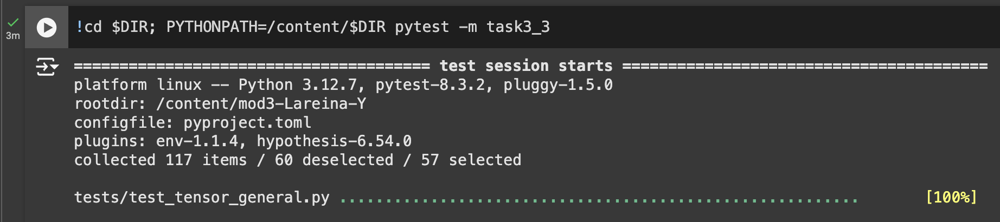

# MiniTorch Module 3


* Docs: https://minitorch.github.io/

* Overview: https://minitorch.github.io/module3.html


You will need to modify `tensor_functions.py` slightly in this assignment.

* Tests:

```
python run_tests.py
```

* Note:

Several of the tests for this assignment will only run if you are on a GPU machine and will not
run on github's test infrastructure. Please follow the instructions to setup up a colab machine
to run these tests.

This assignment requires the following files from the previous assignments. You can get these by running

```bash
python sync_previous_module.py previous-module-dir current-module-dir
```

The files that will be synced are:

        minitorch/tensor_data.py minitorch/tensor_functions.py minitorch/tensor_ops.py minitorch/operators.py minitorch/scalar.py minitorch/scalar_functions.py minitorch/module.py minitorch/autodiff.py minitorch/module.py project/run_manual.py project/run_scalar.py project/run_tensor.py minitorch/operators.py minitorch/module.py minitorch/autodiff.py minitorch/tensor.py minitorch/datasets.py minitorch/testing.py minitorch/optim.py

## Task 3.1 & 3.2 Diagnostics Output

<pre style="max-height: 200px; overflow-y: scroll;">
MAP
OMP: Info #276: omp_set_nested routine deprecated, please use omp_set_max_active_levels instead.

================================================================================
 Parallel Accelerator Optimizing:  Function tensor_map.<locals>._map, /Users/shi
wen/Documents/GitHub/MLE/MiniTorch/mod3-Lareina-Y/minitorch/fast_ops.py (164)
================================================================================


Parallel loop listing for  Function tensor_map.<locals>._map, /Users/shiwen/Documents/GitHub/MLE/MiniTorch/mod3-Lareina-Y/minitorch/fast_ops.py (164)
----------------------------------------------------------------------------------------|loop #ID
    def _map(                                                                           |
        out: Storage,                                                                   |
        out_shape: Shape,                                                               |
        out_strides: Strides,                                                           |
        in_storage: Storage,                                                            |
        in_shape: Shape,                                                                |
        in_strides: Strides,                                                            |
    ) -> None:                                                                          |
        stride_aligned = np.array_equal(out_strides, in_strides) and np.array_equal(    |
            out_shape, in_shape                                                         |
        )                                                                               |
                                                                                        |
        if stride_aligned:  # When stride-aligned, avoid indexing                       |
            for i in prange(len(out)):--------------------------------------------------| #2
                out[i] = fn(in_storage[i])                                              |
        else:                                                                           |
            for i in prange(len(out)):--------------------------------------------------| #3
                out_index: Index = np.zeros(MAX_DIMS, dtype=np.int32)-------------------| #0
                in_index: Index = np.zeros(MAX_DIMS, dtype=np.int32)--------------------| #1
                                                                                        |
                to_index(i, out_shape, out_index)                                       |
                broadcast_index(out_index, out_shape, in_shape, in_index)               |
                in_pos = index_to_position(in_index, in_strides)                        |
                out_pos = index_to_position(out_index, out_strides)                     |
                                                                                        |
                out[out_pos] = fn(in_storage[in_pos])                                   |
--------------------------------- Fusing loops ---------------------------------
Attempting fusion of parallel loops (combines loops with similar properties)...

Fused loop summary:
+--0 has the following loops fused into it:
   +--1 (fused)
Following the attempted fusion of parallel for-loops there are 3 parallel for-
loop(s) (originating from loops labelled: #2, #3, #0).
--------------------------------------------------------------------------------
---------------------------- Optimising loop nests -----------------------------
Attempting loop nest rewrites (optimising for the largest parallel loops)...

+--3 is a parallel loop
   +--0 --> rewritten as a serial loop
--------------------------------------------------------------------------------
----------------------------- Before Optimisation ------------------------------
Parallel region 0:
+--3 (parallel)
   +--0 (parallel)
   +--1 (parallel)


--------------------------------------------------------------------------------
------------------------------ After Optimisation ------------------------------
Parallel region 0:
+--3 (parallel)
   +--0 (serial, fused with loop(s): 1)


Parallel region 0 (loop #3) had 1 loop(s) fused and 1 loop(s) serialized as part
 of the larger parallel loop (#3).
--------------------------------------------------------------------------------
--------------------------------------------------------------------------------

---------------------------Loop invariant code motion---------------------------
Allocation hoisting:
The memory allocation derived from the instruction at /Users/shiwen/Documents/Gi
tHub/MLE/MiniTorch/mod3-Lareina-Y/minitorch/fast_ops.py (181) is hoisted out of
the parallel loop labelled #3 (it will be performed before the loop is executed
and reused inside the loop):
   Allocation:: out_index: Index = np.zeros(MAX_DIMS, dtype=np.int32)
    - numpy.empty() is used for the allocation.
The memory allocation derived from the instruction at /Users/shiwen/Documents/Gi
tHub/MLE/MiniTorch/mod3-Lareina-Y/minitorch/fast_ops.py (182) is hoisted out of
the parallel loop labelled #3 (it will be performed before the loop is executed
and reused inside the loop):
   Allocation:: in_index: Index = np.zeros(MAX_DIMS, dtype=np.int32)
    - numpy.empty() is used for the allocation.
None
ZIP

================================================================================
 Parallel Accelerator Optimizing:  Function tensor_zip.<locals>._zip, /Users/shi
wen/Documents/GitHub/MLE/MiniTorch/mod3-Lareina-Y/minitorch/fast_ops.py (217)
================================================================================


Parallel loop listing for  Function tensor_zip.<locals>._zip, /Users/shiwen/Documents/GitHub/MLE/MiniTorch/mod3-Lareina-Y/minitorch/fast_ops.py (217)
---------------------------------------------------------------------------|loop #ID
    def _zip(                                                              |
        out: Storage,                                                      |
        out_shape: Shape,                                                  |
        out_strides: Strides,                                              |
        a_storage: Storage,                                                |
        a_shape: Shape,                                                    |
        a_strides: Strides,                                                |
        b_storage: Storage,                                                |
        b_shape: Shape,                                                    |
        b_strides: Strides,                                                |
    ) -> None:                                                             |
        stride_aligned = (                                                 |
            np.array_equal(out_strides, a_strides)                         |
            and np.array_equal(out_strides, b_strides)                     |
            and np.array_equal(out_shape, a_shape)                         |
            and np.array_equal(out_shape, b_shape)                         |
        )                                                                  |
                                                                           |
        if stride_aligned:  # When stride-aligned, avoid indexing          |
            for i in prange(len(out)):-------------------------------------| #7
                out[i] = fn(a_storage[i], b_storage[i])                    |
        else:                                                              |
            for i in prange(len(out)):-------------------------------------| #8
                out_index: Index = np.zeros(MAX_DIMS, dtype=np.int32)------| #4
                a_index: Index = np.zeros(MAX_DIMS, dtype=np.int32)--------| #5
                b_index: Index = np.zeros(MAX_DIMS, dtype=np.int32)--------| #6
                                                                           |
                to_index(i, out_shape, out_index)                          |
                broadcast_index(out_index, out_shape, a_shape, a_index)    |
                broadcast_index(out_index, out_shape, b_shape, b_index)    |
                                                                           |
                a_pos = index_to_position(a_index, a_strides)              |
                b_pos = index_to_position(b_index, b_strides)              |
                out_pos = index_to_position(out_index, out_strides)        |
                                                                           |
                out[out_pos] = fn(a_storage[a_pos], b_storage[b_pos])      |
--------------------------------- Fusing loops ---------------------------------
Attempting fusion of parallel loops (combines loops with similar properties)...

Fused loop summary:
+--4 has the following loops fused into it:
   +--5 (fused)
   +--6 (fused)
Following the attempted fusion of parallel for-loops there are 3 parallel for-
loop(s) (originating from loops labelled: #7, #8, #4).
--------------------------------------------------------------------------------
---------------------------- Optimising loop nests -----------------------------
Attempting loop nest rewrites (optimising for the largest parallel loops)...

+--8 is a parallel loop
   +--4 --> rewritten as a serial loop
--------------------------------------------------------------------------------
----------------------------- Before Optimisation ------------------------------
Parallel region 0:
+--8 (parallel)
   +--4 (parallel)
   +--5 (parallel)
   +--6 (parallel)


--------------------------------------------------------------------------------
------------------------------ After Optimisation ------------------------------
Parallel region 0:
+--8 (parallel)
   +--4 (serial, fused with loop(s): 5, 6)


Parallel region 0 (loop #8) had 2 loop(s) fused and 1 loop(s) serialized as part
 of the larger parallel loop (#8).
--------------------------------------------------------------------------------
--------------------------------------------------------------------------------

---------------------------Loop invariant code motion---------------------------
Allocation hoisting:
The memory allocation derived from the instruction at /Users/shiwen/Documents/Gi
tHub/MLE/MiniTorch/mod3-Lareina-Y/minitorch/fast_ops.py (240) is hoisted out of
the parallel loop labelled #8 (it will be performed before the loop is executed
and reused inside the loop):
   Allocation:: out_index: Index = np.zeros(MAX_DIMS, dtype=np.int32)
    - numpy.empty() is used for the allocation.
The memory allocation derived from the instruction at /Users/shiwen/Documents/Gi
tHub/MLE/MiniTorch/mod3-Lareina-Y/minitorch/fast_ops.py (241) is hoisted out of
the parallel loop labelled #8 (it will be performed before the loop is executed
and reused inside the loop):
   Allocation:: a_index: Index = np.zeros(MAX_DIMS, dtype=np.int32)
    - numpy.empty() is used for the allocation.
The memory allocation derived from the instruction at /Users/shiwen/Documents/Gi
tHub/MLE/MiniTorch/mod3-Lareina-Y/minitorch/fast_ops.py (242) is hoisted out of
the parallel loop labelled #8 (it will be performed before the loop is executed
and reused inside the loop):
   Allocation:: b_index: Index = np.zeros(MAX_DIMS, dtype=np.int32)
    - numpy.empty() is used for the allocation.
None
REDUCE

================================================================================
 Parallel Accelerator Optimizing:  Function tensor_reduce.<locals>._reduce, /Use
rs/shiwen/Documents/GitHub/MLE/MiniTorch/mod3-Lareina-Y/minitorch/fast_ops.py
(278)
================================================================================


Parallel loop listing for  Function tensor_reduce.<locals>._reduce, /Users/shiwen/Documents/GitHub/MLE/MiniTorch/mod3-Lareina-Y/minitorch/fast_ops.py (278)
---------------------------------------------------------------------|loop #ID
    def _reduce(                                                     |
        out: Storage,                                                |
        out_shape: Shape,                                            |
        out_strides: Strides,                                        |
        a_storage: Storage,                                          |
        a_shape: Shape,                                              |
        a_strides: Strides,                                          |
        reduce_dim: int,                                             |
    ) -> None:                                                       |
        for i in prange(len(out)):-----------------------------------| #10
            out_index: Index = np.zeros(MAX_DIMS, dtype=np.int32)----| #9
            to_index(i, out_shape, out_index)                        |
            out_pos = index_to_position(out_index, out_strides)      |
                                                                     |
            for s in range(a_shape[reduce_dim]):                     |
                out_index[reduce_dim] = s                            |
                j = index_to_position(out_index, a_strides)          |
                out[out_pos] = fn(out[out_pos], a_storage[j])        |
--------------------------------- Fusing loops ---------------------------------
Attempting fusion of parallel loops (combines loops with similar properties)...
Following the attempted fusion of parallel for-loops there are 2 parallel for-
loop(s) (originating from loops labelled: #10, #9).
--------------------------------------------------------------------------------
---------------------------- Optimising loop nests -----------------------------
Attempting loop nest rewrites (optimising for the largest parallel loops)...

+--10 is a parallel loop
   +--9 --> rewritten as a serial loop
--------------------------------------------------------------------------------
----------------------------- Before Optimisation ------------------------------
Parallel region 0:
+--10 (parallel)
   +--9 (parallel)


--------------------------------------------------------------------------------
------------------------------ After Optimisation ------------------------------
Parallel region 0:
+--10 (parallel)
   +--9 (serial)


Parallel region 0 (loop #10) had 0 loop(s) fused and 1 loop(s) serialized as
part of the larger parallel loop (#10).
--------------------------------------------------------------------------------
--------------------------------------------------------------------------------

---------------------------Loop invariant code motion---------------------------
Allocation hoisting:
The memory allocation derived from the instruction at /Users/shiwen/Documents/Gi
tHub/MLE/MiniTorch/mod3-Lareina-Y/minitorch/fast_ops.py (288) is hoisted out of
the parallel loop labelled #10 (it will be performed before the loop is executed
 and reused inside the loop):
   Allocation:: out_index: Index = np.zeros(MAX_DIMS, dtype=np.int32)
    - numpy.empty() is used for the allocation.
None
MATRIX MULTIPLY

================================================================================
 Parallel Accelerator Optimizing:  Function _tensor_matrix_multiply, /Users/shiw
en/Documents/GitHub/MLE/MiniTorch/mod3-Lareina-Y/minitorch/fast_ops.py (300)
================================================================================


Parallel loop listing for  Function _tensor_matrix_multiply, /Users/shiwen/Documents/GitHub/MLE/MiniTorch/mod3-Lareina-Y/minitorch/fast_ops.py (300)
------------------------------------------------------------------------------------------|loop #ID
def _tensor_matrix_multiply(                                                              |
    out: Storage,                                                                         |
    out_shape: Shape,                                                                     |
    out_strides: Strides,                                                                 |
    a_storage: Storage,                                                                   |
    a_shape: Shape,                                                                       |
    a_strides: Strides,                                                                   |
    b_storage: Storage,                                                                   |
    b_shape: Shape,                                                                       |
    b_strides: Strides,                                                                   |
) -> None:                                                                                |
    """NUMBA tensor matrix multiply function.                                             |
                                                                                          |
    Should work for any tensor shapes that broadcast as long as                           |
                                                                                          |
    ```                                                                                   |
    assert a_shape[-1] == b_shape[-2]                                                     |
    ```                                                                                   |
                                                                                          |
    Optimizations:                                                                        |
                                                                                          |
    * Outer loop in parallel                                                              |
    * No index buffers or function calls                                                  |
    * Inner loop should have no global writes, 1 multiply.                                |
                                                                                          |
                                                                                          |
    Args:                                                                                 |
    ----                                                                                  |
        out (Storage): storage for `out` tensor                                           |
        out_shape (Shape): shape for `out` tensor                                         |
        out_strides (Strides): strides for `out` tensor                                   |
        a_storage (Storage): storage for `a` tensor                                       |
        a_shape (Shape): shape for `a` tensor                                             |
        a_strides (Strides): strides for `a` tensor                                       |
        b_storage (Storage): storage for `b` tensor                                       |
        b_shape (Shape): shape for `b` tensor                                             |
        b_strides (Strides): strides for `b` tensor                                       |
                                                                                          |
    Returns:                                                                              |
    -------                                                                               |
        None : Fills in `out`                                                             |
                                                                                          |
    """                                                                                   |
    a_batch_stride = a_strides[0] if a_shape[0] > 1 else 0                                |
    b_batch_stride = b_strides[0] if b_shape[0] > 1 else 0                                |
                                                                                          |
    for n in prange(out_shape[0]):--------------------------------------------------------| #13
        for i in prange(out_shape[1]):----------------------------------------------------| #12
            for j in prange(out_shape[2]):------------------------------------------------| #11
                out_idx = n * out_strides[0] + i * out_strides[1] + j * out_strides[2]    |
                out[out_idx] = 0.0                                                        |
                for k in range(a_shape[-1]):  # Compute the dot product                   |
                    a_idx = n * a_batch_stride + i * a_strides[1] + k * a_strides[2]      |
                    b_idx = n * b_batch_stride + k * b_strides[1] + j * b_strides[2]      |
                    out[out_idx] += a_storage[a_idx] * b_storage[b_idx]                   |
--------------------------------- Fusing loops ---------------------------------
Attempting fusion of parallel loops (combines loops with similar properties)...
Following the attempted fusion of parallel for-loops there are 2 parallel for-
loop(s) (originating from loops labelled: #13, #12).
--------------------------------------------------------------------------------
---------------------------- Optimising loop nests -----------------------------
Attempting loop nest rewrites (optimising for the largest parallel loops)...

+--13 is a parallel loop
   +--12 --> rewritten as a serial loop
      +--11 --> rewritten as a serial loop
--------------------------------------------------------------------------------
----------------------------- Before Optimisation ------------------------------
Parallel region 0:
+--13 (parallel)
   +--12 (parallel)
      +--11 (parallel)


--------------------------------------------------------------------------------
------------------------------ After Optimisation ------------------------------
Parallel region 0:
+--13 (parallel)
   +--12 (serial)
      +--11 (serial)


Parallel region 0 (loop #13) had 0 loop(s) fused and 2 loop(s) serialized as
part of the larger parallel loop (#13).
--------------------------------------------------------------------------------
--------------------------------------------------------------------------------

---------------------------Loop invariant code motion---------------------------
Allocation hoisting:
No allocation hoisting found
None
</pre>

## Task 3.3 & 3.4 Test Result on Colab




## Task 3.5

### Simple Dataset
```bash
!cd $DIR; PYTHONPATH=/content/$DIR python3.12 project/run_fast_tensor.py --BACKEND gpu --HIDDEN 100 --DATASET simple --RATE 0.05
```
Time per epoch: 1.23 sec
<pre style="max-height: 200px; overflow-y: scroll;">
Epoch 0 | loss  6.61456323513476 | correct 30 | Time per epoch: 4.97 sec
Epoch 10 | loss  6.7495709287973265 | correct 30 | Time per epoch: 1.56 sec
Epoch 20 | loss  5.256689561145741 | correct 35 | Time per epoch: 1.4 sec
Epoch 30 | loss  4.7314431408178095 | correct 45 | Time per epoch: 1.34 sec
Epoch 40 | loss  2.467133187363966 | correct 50 | Time per epoch: 1.31 sec
Epoch 50 | loss  1.452720214427227 | correct 50 | Time per epoch: 1.31 sec
Epoch 60 | loss  0.7224204032251071 | correct 50 | Time per epoch: 1.29 sec
Epoch 70 | loss  1.0899040647522718 | correct 50 | Time per epoch: 1.28 sec
Epoch 80 | loss  0.698254343804886 | correct 50 | Time per epoch: 1.27 sec
Epoch 90 | loss  0.0663371877816097 | correct 50 | Time per epoch: 1.26 sec
Epoch 100 | loss  0.228188355912875 | correct 50 | Time per epoch: 1.26 sec
Epoch 110 | loss  0.38011473499764725 | correct 50 | Time per epoch: 1.25 sec
Epoch 120 | loss  0.4234678965291306 | correct 50 | Time per epoch: 1.25 sec
Epoch 130 | loss  0.20145948625655238 | correct 50 | Time per epoch: 1.25 sec
Epoch 140 | loss  0.8428578700507992 | correct 50 | Time per epoch: 1.25 sec
Epoch 150 | loss  0.01328731473805005 | correct 50 | Time per epoch: 1.25 sec
Epoch 160 | loss  0.6455673530964221 | correct 49 | Time per epoch: 1.24 sec
Epoch 170 | loss  0.24971308008518972 | correct 49 | Time per epoch: 1.24 sec
Epoch 180 | loss  0.5159780682812639 | correct 50 | Time per epoch: 1.24 sec
Epoch 190 | loss  0.012922972522012778 | correct 50 | Time per epoch: 1.24 sec
Epoch 200 | loss  0.7616651192696124 | correct 49 | Time per epoch: 1.24 sec
Epoch 210 | loss  0.0091760744314644 | correct 50 | Time per epoch: 1.24 sec
Epoch 220 | loss  0.07410479910991688 | correct 50 | Time per epoch: 1.24 sec
Epoch 230 | loss  0.05587349197544153 | correct 49 | Time per epoch: 1.24 sec
Epoch 240 | loss  0.8276701544904723 | correct 49 | Time per epoch: 1.24 sec
Epoch 250 | loss  0.32270858202554 | correct 50 | Time per epoch: 1.24 sec
Epoch 260 | loss  0.21850083090976774 | correct 50 | Time per epoch: 1.24 sec
Epoch 270 | loss  0.06516133576191215 | correct 50 | Time per epoch: 1.24 sec
Epoch 280 | loss  0.24774169952742991 | correct 50 | Time per epoch: 1.24 sec
Epoch 290 | loss  0.2364495179115659 | correct 50 | Time per epoch: 1.24 sec
Epoch 300 | loss  0.0494554882827839 | correct 50 | Time per epoch: 1.24 sec
Epoch 310 | loss  0.35322230654143544 | correct 50 | Time per epoch: 1.24 sec
Epoch 320 | loss  0.359027227354134 | correct 50 | Time per epoch: 1.23 sec
Epoch 330 | loss  0.007458476912360831 | correct 49 | Time per epoch: 1.23 sec
Epoch 340 | loss  0.4585119262327232 | correct 50 | Time per epoch: 1.23 sec
Epoch 350 | loss  0.07514577130595614 | correct 50 | Time per epoch: 1.23 sec
Epoch 360 | loss  0.3654429478970772 | correct 50 | Time per epoch: 1.23 sec
Epoch 370 | loss  0.0011221144589962247 | correct 49 | Time per epoch: 1.23 sec
Epoch 380 | loss  0.004305684154092574 | correct 49 | Time per epoch: 1.23 sec
Epoch 390 | loss  0.000714596469865057 | correct 50 | Time per epoch: 1.23 sec
Epoch 400 | loss  0.3466389649377674 | correct 50 | Time per epoch: 1.23 sec
Epoch 410 | loss  0.0012715251718395295 | correct 50 | Time per epoch: 1.23 sec
Epoch 420 | loss  0.004549251163991604 | correct 50 | Time per epoch: 1.23 sec
Epoch 430 | loss  0.0015884227063450935 | correct 50 | Time per epoch: 1.23 sec
Epoch 440 | loss  0.2786167596943171 | correct 50 | Time per epoch: 1.23 sec
Epoch 450 | loss  0.009408737747837799 | correct 50 | Time per epoch: 1.23 sec
Epoch 460 | loss  0.29662363668613184 | correct 50 | Time per epoch: 1.23 sec
Epoch 470 | loss  0.2756877154847575 | correct 50 | Time per epoch: 1.23 sec
Epoch 480 | loss  0.30376907098121186 | correct 50 | Time per epoch: 1.23 sec
Epoch 490 | loss  0.24585029196284164 | correct 50 | Time per epoch: 1.23 sec
Epoch 500 | loss  0.000377350906533953 | correct 50 | Time per epoch: 1.23 sec
</pre>


```bash
!cd $DIR; PYTHONPATH=/content/$DIR python3.12 project/run_fast_tensor.py --BACKEND cpu --HIDDEN 100 --DATASET simple --RATE 0.05
```
Time per epoch: 0.15 sec
<pre style="max-height: 200px; overflow-y: scroll;">
Epoch 0 | loss  3.894613327936898 | correct 42 | Time per epoch: 24.82 sec
Epoch 10 | loss  1.3145704548750803 | correct 50 | Time per epoch: 2.34 sec
Epoch 20 | loss  0.5208789785995764 | correct 50 | Time per epoch: 1.27 sec
Epoch 30 | loss  0.8683533862222094 | correct 50 | Time per epoch: 0.89 sec
Epoch 40 | loss  0.3076911433708404 | correct 50 | Time per epoch: 0.69 sec
Epoch 50 | loss  0.35584115716460063 | correct 50 | Time per epoch: 0.57 sec
Epoch 60 | loss  0.5123449394585289 | correct 50 | Time per epoch: 0.5 sec
Epoch 70 | loss  0.16375918822371535 | correct 50 | Time per epoch: 0.44 sec
Epoch 80 | loss  0.012013445564581842 | correct 50 | Time per epoch: 0.39 sec
Epoch 90 | loss  0.45828527495722504 | correct 50 | Time per epoch: 0.37 sec
Epoch 100 | loss  0.5192329862942167 | correct 50 | Time per epoch: 0.34 sec
Epoch 110 | loss  0.33871559494250136 | correct 50 | Time per epoch: 0.32 sec
Epoch 120 | loss  0.41966839766655617 | correct 50 | Time per epoch: 0.3 sec
Epoch 130 | loss  0.6182282802863067 | correct 50 | Time per epoch: 0.29 sec
Epoch 140 | loss  0.0028076874323793495 | correct 50 | Time per epoch: 0.27 sec
Epoch 150 | loss  0.016528636481821006 | correct 50 | Time per epoch: 0.26 sec
Epoch 160 | loss  0.436834961901806 | correct 50 | Time per epoch: 0.25 sec
Epoch 170 | loss  0.13659537284077078 | correct 50 | Time per epoch: 0.24 sec
Epoch 180 | loss  0.012451407137533769 | correct 50 | Time per epoch: 0.23 sec
Epoch 190 | loss  0.10570876649473974 | correct 50 | Time per epoch: 0.23 sec
Epoch 200 | loss  0.01634581423791139 | correct 50 | Time per epoch: 0.22 sec
Epoch 210 | loss  0.049276042221837284 | correct 50 | Time per epoch: 0.21 sec
Epoch 220 | loss  0.07595325200238764 | correct 50 | Time per epoch: 0.21 sec
Epoch 230 | loss  0.32030715437030016 | correct 50 | Time per epoch: 0.21 sec
Epoch 240 | loss  0.05052893426182585 | correct 50 | Time per epoch: 0.2 sec
Epoch 250 | loss  0.00594266998417155 | correct 50 | Time per epoch: 0.2 sec
Epoch 260 | loss  0.006735518692901349 | correct 50 | Time per epoch: 0.19 sec
Epoch 270 | loss  0.06566810769856214 | correct 50 | Time per epoch: 0.19 sec
Epoch 280 | loss  0.23455524238741995 | correct 50 | Time per epoch: 0.19 sec
Epoch 290 | loss  0.05646631379281097 | correct 50 | Time per epoch: 0.18 sec
Epoch 300 | loss  0.05943961481469355 | correct 50 | Time per epoch: 0.18 sec
Epoch 310 | loss  0.017742998455824784 | correct 50 | Time per epoch: 0.18 sec
Epoch 320 | loss  0.35946610847595406 | correct 50 | Time per epoch: 0.17 sec
Epoch 330 | loss  0.3879570142468587 | correct 50 | Time per epoch: 0.17 sec
Epoch 340 | loss  0.0032412963208134833 | correct 50 | Time per epoch: 0.17 sec
Epoch 350 | loss  0.011361809931303068 | correct 50 | Time per epoch: 0.17 sec
Epoch 360 | loss  0.005591302801640458 | correct 50 | Time per epoch: 0.17 sec
Epoch 370 | loss  0.001684853460892931 | correct 50 | Time per epoch: 0.17 sec
Epoch 380 | loss  0.2316866568167102 | correct 50 | Time per epoch: 0.16 sec
Epoch 390 | loss  0.003114267783976699 | correct 50 | Time per epoch: 0.16 sec
Epoch 400 | loss  0.2515890891450148 | correct 50 | Time per epoch: 0.16 sec
Epoch 410 | loss  0.17054450163507154 | correct 50 | Time per epoch: 0.16 sec
Epoch 420 | loss  0.013702300340470886 | correct 50 | Time per epoch: 0.16 sec
Epoch 430 | loss  0.023265500942274638 | correct 50 | Time per epoch: 0.16 sec
Epoch 440 | loss  0.013619723672765026 | correct 50 | Time per epoch: 0.15 sec
Epoch 450 | loss  0.04073489022065585 | correct 50 | Time per epoch: 0.15 sec
Epoch 460 | loss  0.008370492612999906 | correct 50 | Time per epoch: 0.15 sec
Epoch 470 | loss  0.0014384891919638344 | correct 50 | Time per epoch: 0.15 sec
Epoch 480 | loss  0.20532481804143973 | correct 50 | Time per epoch: 0.15 sec
Epoch 490 | loss  0.03165709820370449 | correct 50 | Time per epoch: 0.15 sec
Epoch 500 | loss  0.21235176920209176 | correct 50 | Time per epoch: 0.15 sec
</pre>

### Split Dataset
```bash
!cd $DIR; PYTHONPATH=/content/$DIR python3.12 project/run_fast_tensor.py --BACKEND gpu --HIDDEN 100 --DATASET split --RATE 0.05
```
Time per epoch: 1.26 sec
<pre style="max-height: 200px; overflow-y: scroll;">
Epoch 0 | loss  6.608143183527434 | correct 37 | Time per epoch: 4.92 sec
Epoch 10 | loss  7.288241728704254 | correct 40 | Time per epoch: 1.59 sec
Epoch 20 | loss  6.667168412479551 | correct 44 | Time per epoch: 1.43 sec
Epoch 30 | loss  4.254350822672032 | correct 45 | Time per epoch: 1.37 sec
Epoch 40 | loss  3.57971925356908 | correct 46 | Time per epoch: 1.34 sec
Epoch 50 | loss  1.6443845926212033 | correct 44 | Time per epoch: 1.32 sec
Epoch 60 | loss  2.757344106072077 | correct 48 | Time per epoch: 1.31 sec
Epoch 70 | loss  2.757519566239388 | correct 50 | Time per epoch: 1.3 sec
Epoch 80 | loss  2.3274120205540836 | correct 48 | Time per epoch: 1.29 sec
Epoch 90 | loss  2.4035863328530738 | correct 48 | Time per epoch: 1.28 sec
Epoch 100 | loss  2.2654567106900685 | correct 46 | Time per epoch: 1.28 sec
Epoch 110 | loss  2.5956435492838157 | correct 50 | Time per epoch: 1.28 sec
Epoch 120 | loss  0.7547013631067261 | correct 49 | Time per epoch: 1.27 sec
Epoch 130 | loss  0.9085499556764579 | correct 49 | Time per epoch: 1.27 sec
Epoch 140 | loss  1.5005046816800793 | correct 49 | Time per epoch: 1.27 sec
Epoch 150 | loss  0.757857755749026 | correct 50 | Time per epoch: 1.27 sec
Epoch 160 | loss  1.4473129328712462 | correct 50 | Time per epoch: 1.27 sec
Epoch 170 | loss  0.6592019182847555 | correct 50 | Time per epoch: 1.26 sec
Epoch 180 | loss  2.302647726109505 | correct 50 | Time per epoch: 1.27 sec
Epoch 190 | loss  1.404478695068194 | correct 50 | Time per epoch: 1.27 sec
Epoch 200 | loss  1.0784946771216075 | correct 48 | Time per epoch: 1.27 sec
Epoch 210 | loss  1.4555204222198745 | correct 50 | Time per epoch: 1.27 sec
Epoch 220 | loss  0.4726321565133643 | correct 50 | Time per epoch: 1.26 sec
Epoch 230 | loss  0.4424615757109423 | correct 47 | Time per epoch: 1.26 sec
Epoch 240 | loss  1.1553574790370655 | correct 50 | Time per epoch: 1.26 sec
Epoch 250 | loss  0.1272717634419987 | correct 50 | Time per epoch: 1.26 sec
Epoch 260 | loss  0.2536381740640413 | correct 50 | Time per epoch: 1.26 sec
Epoch 270 | loss  0.21117169326221852 | correct 50 | Time per epoch: 1.26 sec
Epoch 280 | loss  1.0274865340747874 | correct 49 | Time per epoch: 1.26 sec
Epoch 290 | loss  0.9118528857586231 | correct 50 | Time per epoch: 1.26 sec
Epoch 300 | loss  0.6798305760576346 | correct 49 | Time per epoch: 1.26 sec
Epoch 310 | loss  0.5431672198034821 | correct 50 | Time per epoch: 1.26 sec
Epoch 320 | loss  0.4798456582174963 | correct 50 | Time per epoch: 1.26 sec
Epoch 330 | loss  0.3892175421094635 | correct 50 | Time per epoch: 1.26 sec
Epoch 340 | loss  0.3218943754807312 | correct 50 | Time per epoch: 1.26 sec
Epoch 350 | loss  0.1723156940172456 | correct 50 | Time per epoch: 1.26 sec
Epoch 360 | loss  0.2308948475023415 | correct 50 | Time per epoch: 1.26 sec
Epoch 370 | loss  0.1987329654892533 | correct 50 | Time per epoch: 1.26 sec
Epoch 380 | loss  0.2745629843291565 | correct 50 | Time per epoch: 1.26 sec
Epoch 390 | loss  0.1457823453291844 | correct 50 | Time per epoch: 1.26 sec
Epoch 400 | loss  0.1236542325083475 | correct 50 | Time per epoch: 1.26 sec
Epoch 410 | loss  0.1087349287928451 | correct 50 | Time per epoch: 1.26 sec
Epoch 420 | loss  0.0943287153013467 | correct 50 | Time per epoch: 1.26 sec
Epoch 430 | loss  0.0841205471392384 | correct 50 | Time per epoch: 1.26 sec
Epoch 440 | loss  0.0496832174298435 | correct 50 | Time per epoch: 1.26 sec
Epoch 450 | loss  0.0639156248172391 | correct 50 | Time per epoch: 1.26 sec
Epoch 460 | loss  0.0562471385098474 | correct 50 | Time per epoch: 1.26 sec
Epoch 470 | loss  0.0726941394872513 | correct 50 | Time per epoch: 1.26 sec
Epoch 480 | loss  0.0435187123085291 | correct 50 | Time per epoch: 1.26 sec
Epoch 490 | loss  0.0378921372104358 | correct 50 | Time per epoch: 1.26 sec
Epoch 500 | loss  0.0332123843098127 | correct 50 | Time per epoch: 1.26 sec

</pre>

```bash
!cd $DIR; PYTHONPATH=/content/$DIR python3.12 project/run_fast_tensor.py --BACKEND cpu --HIDDEN 100 --DATASET split --RATE 0.05
```
Time per epoch: 0.15 sec
<pre style="max-height: 200px; overflow-y: scroll;">
Epoch 0 | loss  6.948264072146883 | correct 28 | Time per epoch: 25.36 sec
Epoch 10 | loss  6.231180133430021 | correct 33 | Time per epoch: 2.47 sec
Epoch 20 | loss  5.542037238818458 | correct 40 | Time per epoch: 1.34 sec
Epoch 30 | loss  4.476328167969502 | correct 46 | Time per epoch: 0.94 sec
Epoch 40 | loss  3.956854244763976 | correct 47 | Time per epoch: 0.73 sec
Epoch 50 | loss  4.63512882082482 | correct 49 | Time per epoch: 0.6 sec
Epoch 60 | loss  2.536031032176865 | correct 47 | Time per epoch: 0.52 sec
Epoch 70 | loss  2.6005262140507726 | correct 49 | Time per epoch: 0.46 sec
Epoch 80 | loss  1.1344725058512668 | correct 48 | Time per epoch: 0.41 sec
Epoch 90 | loss  2.333085014061104 | correct 48 | Time per epoch: 0.38 sec
Epoch 100 | loss  1.5494681044219156 | correct 48 | Time per epoch: 0.35 sec
Epoch 110 | loss  2.006636527665711 | correct 48 | Time per epoch: 0.33 sec
Epoch 120 | loss  1.9323571065563625 | correct 48 | Time per epoch: 0.31 sec
Epoch 130 | loss  1.4132341688443186 | correct 49 | Time per epoch: 0.3 sec
Epoch 140 | loss  0.6840125006521423 | correct 49 | Time per epoch: 0.29 sec
Epoch 150 | loss  0.7797767227148807 | correct 48 | Time per epoch: 0.27 sec
Epoch 160 | loss  0.8191067640142231 | correct 48 | Time per epoch: 0.26 sec
Epoch 170 | loss  1.4262072427238752 | correct 48 | Time per epoch: 0.25 sec
Epoch 180 | loss  2.664714552325205 | correct 50 | Time per epoch: 0.24 sec
Epoch 190 | loss  0.9399514220950103 | correct 49 | Time per epoch: 0.23 sec
Epoch 200 | loss  1.0042755534081647 | correct 49 | Time per epoch: 0.23 sec
Epoch 210 | loss  1.6214481262694163 | correct 50 | Time per epoch: 0.22 sec
Epoch 220 | loss  1.6790318134647408 | correct 50 | Time per epoch: 0.21 sec
Epoch 230 | loss  1.4525376919217678 | correct 50 | Time per epoch: 0.21 sec
Epoch 240 | loss  0.2767129481774989 | correct 48 | Time per epoch: 0.2 sec
Epoch 250 | loss  1.2431014465539392 | correct 48 | Time per epoch: 0.2 sec
Epoch 260 | loss  1.380146100545569 | correct 49 | Time per epoch: 0.2 sec
Epoch 270 | loss  1.0718730609283789 | correct 47 | Time per epoch: 0.2 sec
Epoch 280 | loss  0.8370975786244794 | correct 50 | Time per epoch: 0.19 sec
Epoch 290 | loss  1.078653850633494 | correct 49 | Time per epoch: 0.19 sec
Epoch 300 | loss  2.4680392182033053 | correct 48 | Time per epoch: 0.19 sec
Epoch 310 | loss  1.247960198892309 | correct 50 | Time per epoch: 0.18 sec
Epoch 320 | loss  0.9368073171258899 | correct 47 | Time per epoch: 0.18 sec
Epoch 330 | loss  0.4770679009285803 | correct 49 | Time per epoch: 0.18 sec
Epoch 340 | loss  0.6499442811560601 | correct 48 | Time per epoch: 0.17 sec
Epoch 350 | loss  0.0866451374825147 | correct 50 | Time per epoch: 0.17 sec
Epoch 360 | loss  0.5219925277038256 | correct 49 | Time per epoch: 0.17 sec
Epoch 370 | loss  0.4866613781349324 | correct 49 | Time per epoch: 0.17 sec
Epoch 380 | loss  0.15930568765880565 | correct 49 | Time per epoch: 0.17 sec
Epoch 390 | loss  0.9077162230750487 | correct 48 | Time per epoch: 0.17 sec
Epoch 400 | loss  0.8866076179989199 | correct 50 | Time per epoch: 0.16 sec
Epoch 410 | loss  0.6605248827963994 | correct 49 | Time per epoch: 0.16 sec
Epoch 420 | loss  0.8384932447849958 | correct 47 | Time per epoch: 0.16 sec
Epoch 430 | loss  1.246452175416967 | correct 50 | Time per epoch: 0.16 sec
Epoch 440 | loss  0.6907277674174578 | correct 48 | Time per epoch: 0.16 sec
Epoch 450 | loss  0.31757856634419623 | correct 49 | Time per epoch: 0.16 sec
Epoch 460 | loss  0.36906732739968906 | correct 49 | Time per epoch: 0.15 sec
Epoch 470 | loss  1.0858873944567013 | correct 48 | Time per epoch: 0.15 sec
Epoch 480 | loss  0.4389424506966547 | correct 50 | Time per epoch: 0.15 sec
Epoch 490 | loss  0.5784244910191885 | correct 49 | Time per epoch: 0.15 sec
Epoch 500 | loss  0.6673285221467843 | correct 48 | Time per epoch: 0.15 sec
</pre>


### Xor Dataset
```bash
!cd $DIR; PYTHONPATH=/content/$DIR python3.12 project/run_fast_tensor.py --BACKEND gpu --HIDDEN 100 --DATASET xor --RATE 0.05
```
Time per epoch: 1.24 sec
<pre style="max-height: 200px; overflow-y: scroll;">
Epoch 0 | loss  5.253831828759292 | correct 33 | Time per epoch: 4.01 sec
Epoch 10 | loss  3.6991694739909513 | correct 44 | Time per epoch: 1.49 sec
Epoch 20 | loss  3.8010853196063477 | correct 44 | Time per epoch: 1.37 sec
Epoch 30 | loss  6.5071026439306685 | correct 40 | Time per epoch: 1.33 sec
Epoch 40 | loss  5.0087011312167276 | correct 45 | Time per epoch: 1.3 sec
Epoch 50 | loss  3.681529013980409 | correct 46 | Time per epoch: 1.29 sec
Epoch 60 | loss  4.7847091629960445 | correct 46 | Time per epoch: 1.28 sec
Epoch 70 | loss  4.982471487138677 | correct 43 | Time per epoch: 1.27 sec
Epoch 80 | loss  2.9793072809646546 | correct 45 | Time per epoch: 1.27 sec
Epoch 90 | loss  1.9037972444777296 | correct 47 | Time per epoch: 1.27 sec
Epoch 100 | loss  2.2757222529105987 | correct 46 | Time per epoch: 1.26 sec
Epoch 110 | loss  2.3942111725792286 | correct 45 | Time per epoch: 1.27 sec
Epoch 120 | loss  2.3971931485738676 | correct 47 | Time per epoch: 1.27 sec
Epoch 130 | loss  2.6071109047659258 | correct 47 | Time per epoch: 1.26 sec
Epoch 140 | loss  3.780419126509454 | correct 44 | Time per epoch: 1.26 sec
Epoch 150 | loss  1.5106342345868888 | correct 48 | Time per epoch: 1.26 sec
Epoch 160 | loss  1.8487920535324396 | correct 45 | Time per epoch: 1.26 sec
Epoch 170 | loss  2.211503422512924 | correct 48 | Time per epoch: 1.26 sec
Epoch 180 | loss  3.908088830941799 | correct 43 | Time per epoch: 1.25 sec
Epoch 190 | loss  1.1022598150345773 | correct 48 | Time per epoch: 1.25 sec
Epoch 200 | loss  1.1326760185142775 | correct 48 | Time per epoch: 1.25 sec
Epoch 210 | loss  0.973893768751378 | correct 47 | Time per epoch: 1.25 sec
Epoch 220 | loss  2.2928899348680494 | correct 48 | Time per epoch: 1.25 sec
Epoch 230 | loss  1.7356514253033313 | correct 49 | Time per epoch: 1.25 sec
Epoch 240 | loss  2.0625888977665157 | correct 48 | Time per epoch: 1.25 sec
Epoch 250 | loss  1.6201370502410455 | correct 49 | Time per epoch: 1.25 sec
Epoch 260 | loss  2.44360982973744 | correct 49 | Time per epoch: 1.25 sec
Epoch 270 | loss  1.0274519729151737 | correct 48 | Time per epoch: 1.25 sec
Epoch 280 | loss  2.177971039304703 | correct 46 | Time per epoch: 1.24 sec
Epoch 290 | loss  1.9536204872292529 | correct 47 | Time per epoch: 1.24 sec
Epoch 300 | loss  1.3169455023834964 | correct 47 | Time per epoch: 1.24 sec
Epoch 310 | loss  3.048529802753065 | correct 47 | Time per epoch: 1.24 sec
Epoch 320 | loss  1.2740105891195364 | correct 48 | Time per epoch: 1.25 sec
Epoch 330 | loss  0.25005646162963524 | correct 49 | Time per epoch: 1.25 sec
Epoch 340 | loss  1.6545270525985944 | correct 49 | Time per epoch: 1.25 sec
Epoch 350 | loss  0.5455427234204443 | correct 49 | Time per epoch: 1.24 sec
Epoch 360 | loss  1.5592888204794906 | correct 49 | Time per epoch: 1.24 sec
Epoch 370 | loss  1.1358655057055194 | correct 49 | Time per epoch: 1.24 sec
Epoch 380 | loss  1.5930305412367 | correct 50 | Time per epoch: 1.24 sec
Epoch 390 | loss  1.4539272819511742 | correct 48 | Time per epoch: 1.24 sec
Epoch 400 | loss  0.5988676759093232 | correct 49 | Time per epoch: 1.24 sec
Epoch 410 | loss  0.9171191837778593 | correct 49 | Time per epoch: 1.24 sec
Epoch 420 | loss  1.8330027440541388 | correct 47 | Time per epoch: 1.24 sec
Epoch 430 | loss  0.6120188671399709 | correct 50 | Time per epoch: 1.24 sec
Epoch 440 | loss  1.1980178468918068 | correct 50 | Time per epoch: 1.24 sec
Epoch 450 | loss  0.8701655462748414 | correct 50 | Time per epoch: 1.24 sec
Epoch 460 | loss  1.7251682650832771 | correct 44 | Time per epoch: 1.24 sec
Epoch 470 | loss  1.2838279881225865 | correct 49 | Time per epoch: 1.24 sec
Epoch 480 | loss  0.6614093834295607 | correct 50 | Time per epoch: 1.24 sec
Epoch 490 | loss  1.445523327899357 | correct 50 | Time per epoch: 1.24 sec
Epoch 500 | loss  0.46666093955798893 | correct 50 | Time per epoch: 1.24 sec
</pre>

```bash
!cd $DIR; PYTHONPATH=/content/$DIR python3.12 project/run_fast_tensor.py --BACKEND cpu --HIDDEN 100 --DATASET xor --RATE 0.05
```
Time per epoch: 0.14 sec
<pre style="max-height: 200px; overflow-y: scroll;">
Epoch 0 | loss  8.065696138077962 | correct 25 | Time per epoch: 19.75 sec
Epoch 10 | loss  4.905685217890509 | correct 46 | Time per epoch: 1.94 sec
Epoch 20 | loss  3.955675067541168 | correct 47 | Time per epoch: 1.06 sec
Epoch 30 | loss  3.3697643781699216 | correct 48 | Time per epoch: 0.75 sec
Epoch 40 | loss  3.136895274072339 | correct 47 | Time per epoch: 0.59 sec
Epoch 50 | loss  3.212243575258479 | correct 46 | Time per epoch: 0.49 sec
Epoch 60 | loss  1.9043469390806624 | correct 47 | Time per epoch: 0.42 sec
Epoch 70 | loss  1.9310925699742585 | correct 48 | Time per epoch: 0.38 sec
Epoch 80 | loss  2.3247722365796157 | correct 50 | Time per epoch: 0.34 sec
Epoch 90 | loss  0.6472698606453476 | correct 48 | Time per epoch: 0.31 sec
Epoch 100 | loss  2.23764359049678 | correct 47 | Time per epoch: 0.29 sec
Epoch 110 | loss  1.5071092373723487 | correct 49 | Time per epoch: 0.27 sec
Epoch 120 | loss  0.4373582453132585 | correct 50 | Time per epoch: 0.26 sec
Epoch 130 | loss  0.6148065101769888 | correct 49 | Time per epoch: 0.25 sec
Epoch 140 | loss  0.5644486538577901 | correct 50 | Time per epoch: 0.24 sec
Epoch 150 | loss  1.3468433460975104 | correct 49 | Time per epoch: 0.23 sec
Epoch 160 | loss  0.5379709306858188 | correct 50 | Time per epoch: 0.22 sec
Epoch 170 | loss  0.23723255599291707 | correct 49 | Time per epoch: 0.22 sec
Epoch 180 | loss  0.6071967889583195 | correct 50 | Time per epoch: 0.21 sec
Epoch 190 | loss  0.5474923989821193 | correct 50 | Time per epoch: 0.2 sec
Epoch 200 | loss  1.0857426423552077 | correct 50 | Time per epoch: 0.2 sec
Epoch 210 | loss  0.8188585320392427 | correct 49 | Time per epoch: 0.19 sec
Epoch 220 | loss  1.2810874491804842 | correct 50 | Time per epoch: 0.19 sec
Epoch 230 | loss  1.3196736440700456 | correct 50 | Time per epoch: 0.18 sec
Epoch 240 | loss  0.5559555616123522 | correct 50 | Time per epoch: 0.18 sec
Epoch 250 | loss  0.2974945703723495 | correct 49 | Time per epoch: 0.18 sec
Epoch 260 | loss  0.2769077503954334 | correct 50 | Time per epoch: 0.17 sec
Epoch 270 | loss  1.2258751747835852 | correct 49 | Time per epoch: 0.17 sec
Epoch 280 | loss  0.11588087856109455 | correct 50 | Time per epoch: 0.17 sec
Epoch 290 | loss  0.10087680516790241 | correct 49 | Time per epoch: 0.17 sec
Epoch 300 | loss  0.40298653967493264 | correct 49 | Time per epoch: 0.17 sec
Epoch 310 | loss  0.45382486618486617 | correct 49 | Time per epoch: 0.16 sec
Epoch 320 | loss  0.16760658757495617 | correct 50 | Time per epoch: 0.16 sec
Epoch 330 | loss  0.03538793496332463 | correct 50 | Time per epoch: 0.16 sec
Epoch 340 | loss  0.7925345791804322 | correct 50 | Time per epoch: 0.16 sec
Epoch 350 | loss  0.3220334867853215 | correct 49 | Time per epoch: 0.15 sec
Epoch 360 | loss  0.6645934353018678 | correct 49 | Time per epoch: 0.15 sec
Epoch 370 | loss  0.37967210197943524 | correct 50 | Time per epoch: 0.15 sec
Epoch 380 | loss  1.0152202023255048 | correct 50 | Time per epoch: 0.15 sec
Epoch 390 | loss  0.22962476774552681 | correct 50 | Time per epoch: 0.15 sec
Epoch 400 | loss  0.9326855487875336 | correct 50 | Time per epoch: 0.15 sec
Epoch 410 | loss  0.11052686824863578 | correct 49 | Time per epoch: 0.15 sec
Epoch 420 | loss  0.36602578616158465 | correct 50 | Time per epoch: 0.15 sec
Epoch 430 | loss  0.07642769373117365 | correct 50 | Time per epoch: 0.15 sec
Epoch 440 | loss  1.0271744033558592 | correct 50 | Time per epoch: 0.15 sec
Epoch 450 | loss  0.1579943198549723 | correct 49 | Time per epoch: 0.14 sec
Epoch 460 | loss  0.29848545402971793 | correct 50 | Time per epoch: 0.14 sec
Epoch 470 | loss  1.1000009207088415 | correct 50 | Time per epoch: 0.14 sec
Epoch 480 | loss  0.8531327529523659 | correct 50 | Time per epoch: 0.14 sec
Epoch 490 | loss  0.010453584960357044 | correct 50 | Time per epoch: 0.14 sec
Epoch 500 | loss  0.044119371220814885 | correct 50 | Time per epoch: 0.14 sec
</pre>

### Bigger model for Simple Dataset

```bash
!cd $DIR; PYTHONPATH=/content/$DIR python3.12 project/run_fast_tensor.py --BACKEND gpu --HIDDEN 200 --DATASET simple --RATE 0.05
```
Time per epoch: 1.37 sec
<pre style="max-height: 200px; overflow-y: scroll;">
Epoch 0 | loss 6.942341214687812 | correct 28 | Time per epoch: 5.62 sec
Epoch 10 | loss 6.503921537912465 | correct 32 | Time per epoch: 1.72 sec
Epoch 20 | loss 4.876721093452178 | correct 40 | Time per epoch: 1.58 sec
Epoch 30 | loss 3.821544786923761 | correct 47 | Time per epoch: 1.53 sec
Epoch 40 | loss 2.124671267890413 | correct 50 | Time per epoch: 1.50 sec
Epoch 50 | loss 1.489324679235214 | correct 50 | Time per epoch: 1.49 sec
Epoch 60 | loss 0.9252670913458271 | correct 50 | Time per epoch: 1.47 sec
Epoch 70 | loss 0.5124387094783728 | correct 50 | Time per epoch: 1.46 sec
Epoch 80 | loss 0.2358135672910933 | correct 50 | Time per epoch: 1.45 sec
Epoch 90 | loss 0.0994871290340521 | correct 50 | Time per epoch: 1.45 sec
Epoch 100 | loss 0.03782245112348755 | correct 50 | Time per epoch: 1.44 sec
Epoch 110 | loss 0.026112932157415896 | correct 50 | Time per epoch: 1.43 sec
Epoch 120 | loss 0.014518604812764389 | correct 50 | Time per epoch: 1.43 sec
Epoch 130 | loss 0.029745612454763845 | correct 50 | Time per epoch: 1.42 sec
Epoch 140 | loss 0.011377054278903212 | correct 50 | Time per epoch: 1.42 sec
Epoch 150 | loss 0.004679387651724312 | correct 50 | Time per epoch: 1.42 sec
Epoch 160 | loss 0.005145603849614592 | correct 50 | Time per epoch: 1.41 sec
Epoch 170 | loss 0.0031978424512371345 | correct 50 | Time per epoch: 1.41 sec
Epoch 180 | loss 0.002541685238953712 | correct 50 | Time per epoch: 1.41 sec
Epoch 190 | loss 0.0029131743195723764 | correct 50 | Time per epoch: 1.40 sec
Epoch 200 | loss 0.001843294891571832 | correct 50 | Time per epoch: 1.40 sec
Epoch 210 | loss 0.0016451324752189372 | correct 50 | Time per epoch: 1.40 sec
Epoch 220 | loss 0.0015320657017284976 | correct 50 | Time per epoch: 1.40 sec
Epoch 230 | loss 0.001217504785671523 | correct 50 | Time per epoch: 1.39 sec
Epoch 240 | loss 0.0010387195731042184 | correct 50 | Time per epoch: 1.39 sec
Epoch 250 | loss 0.000891047184537123 | correct 50 | Time per epoch: 1.39 sec
Epoch 260 | loss 0.0007782652374912923 | correct 50 | Time per epoch: 1.39 sec
Epoch 270 | loss 0.000658139521374672 | correct 50 | Time per epoch: 1.39 sec
Epoch 280 | loss 0.0005978456523412975 | correct 50 | Time per epoch: 1.39 sec
Epoch 290 | loss 0.0005464289234817253 | correct 50 | Time per epoch: 1.39 sec
Epoch 300 | loss 0.00047361245761583234 | correct 50 | Time per epoch: 1.38 sec
Epoch 310 | loss 0.0004326542389172411 | correct 50 | Time per epoch: 1.38 sec
Epoch 320 | loss 0.000405642339761823 | correct 50 | Time per epoch: 1.38 sec
Epoch 330 | loss 0.0003783419678523642 | correct 50 | Time per epoch: 1.38 sec
Epoch 340 | loss 0.00034721594305648947 | correct 50 | Time per epoch: 1.38 sec
Epoch 350 | loss 0.00032864127906543785 | correct 50 | Time per epoch: 1.38 sec
Epoch 360 | loss 0.000311298752486235 | correct 50 | Time per epoch: 1.38 sec
Epoch 370 | loss 0.0002979286587819238 | correct 50 | Time per epoch: 1.38 sec
Epoch 380 | loss 0.0002815327640937257 | correct 50 | Time per epoch: 1.38 sec
Epoch 390 | loss 0.00027191572685328136 | correct 50 | Time per epoch: 1.38 sec
Epoch 400 | loss 0.00026081213678561434 | correct 50 | Time per epoch: 1.37 sec
Epoch 410 | loss 0.0002521576938243894 | correct 50 | Time per epoch: 1.37 sec
Epoch 420 | loss 0.00024465230190413863 | correct 50 | Time per epoch: 1.37 sec
Epoch 430 | loss 0.00023823496254934785 | correct 50 | Time per epoch: 1.37 sec
Epoch 440 | loss 0.0002318547123987123 | correct 50 | Time per epoch: 1.37 sec
Epoch 450 | loss 0.0002261571295413621 | correct 50 | Time per epoch: 1.37 sec
Epoch 460 | loss 0.0002211198748136478 | correct 50 | Time per epoch: 1.37 sec
Epoch 470 | loss 0.0002171030245723596 | correct 50 | Time per epoch: 1.37 sec
Epoch 480 | loss 0.00021305572426398514 | correct 50 | Time per epoch: 1.37 sec
Epoch 490 | loss 0.00020996543716243156 | correct 50 | Time per epoch: 1.37 sec
Epoch 500 | loss 0.0002068763279216824 | correct 50 | Time per epoch: 1.37 sec
</pre>


```bash
!cd $DIR; PYTHONPATH=/content/$DIR python3.12 project/run_fast_tensor.py --BACKEND cpu --HIDDEN 200 --DATASET simple --RATE 0.05
```
Time per epoch: 0.09 sec
<pre style="max-height: 200px; overflow-y: scroll;">
Epoch 0 | loss  12.246352598245041 | correct 42 | Time per epoch: 5.42 sec
Epoch 10 | loss  0.9742113075081346 | correct 49 | Time per epoch: 0.56 sec
Epoch 20 | loss  0.6686585548107956 | correct 50 | Time per epoch: 0.32 sec
Epoch 30 | loss  0.9012258474306994 | correct 50 | Time per epoch: 0.24 sec
Epoch 40 | loss  1.57008847609952 | correct 50 | Time per epoch: 0.2 sec
Epoch 50 | loss  0.07836827837174651 | correct 50 | Time per epoch: 0.18 sec
Epoch 60 | loss  0.42362487357333406 | correct 50 | Time per epoch: 0.16 sec
Epoch 70 | loss  0.04099504520023849 | correct 50 | Time per epoch: 0.15 sec
Epoch 80 | loss  0.2263041458265421 | correct 50 | Time per epoch: 0.14 sec
Epoch 90 | loss  0.39236018583835286 | correct 50 | Time per epoch: 0.13 sec
Epoch 100 | loss  0.21274870210552235 | correct 50 | Time per epoch: 0.13 sec
Epoch 110 | loss  0.3961431418337591 | correct 50 | Time per epoch: 0.12 sec
Epoch 120 | loss  0.31150395278946746 | correct 50 | Time per epoch: 0.12 sec
Epoch 130 | loss  0.545511003099396 | correct 50 | Time per epoch: 0.12 sec
Epoch 140 | loss  0.5336727286480888 | correct 50 | Time per epoch: 0.11 sec
Epoch 150 | loss  0.15299446988685092 | correct 50 | Time per epoch: 0.11 sec
Epoch 160 | loss  0.12345811963715873 | correct 50 | Time per epoch: 0.11 sec
Epoch 170 | loss  0.33585693192847954 | correct 50 | Time per epoch: 0.11 sec
Epoch 180 | loss  0.06241155793934681 | correct 50 | Time per epoch: 0.11 sec
Epoch 190 | loss  0.009585302788569712 | correct 50 | Time per epoch: 0.1 sec
Epoch 200 | loss  0.2323870820119631 | correct 50 | Time per epoch: 0.1 sec
Epoch 210 | loss  0.2469631807595571 | correct 50 | Time per epoch: 0.1 sec
Epoch 220 | loss  0.0034316685451730067 | correct 50 | Time per epoch: 0.1 sec
Epoch 230 | loss  0.0007771781761028563 | correct 50 | Time per epoch: 0.1 sec
Epoch 240 | loss  0.18808910954669877 | correct 50 | Time per epoch: 0.1 sec
Epoch 250 | loss  0.12775245319409803 | correct 50 | Time per epoch: 0.1 sec
Epoch 260 | loss  0.13222981547963378 | correct 50 | Time per epoch: 0.1 sec
Epoch 270 | loss  0.2920674414525153 | correct 50 | Time per epoch: 0.1 sec
Epoch 280 | loss  0.13495235731661467 | correct 50 | Time per epoch: 0.09 sec
Epoch 290 | loss  0.006937321198774884 | correct 50 | Time per epoch: 0.09 sec
Epoch 300 | loss  0.00550196169357741 | correct 50 | Time per epoch: 0.09 sec
Epoch 310 | loss  0.02689802636064068 | correct 50 | Time per epoch: 0.09 sec
Epoch 320 | loss  0.18696551744737192 | correct 50 | Time per epoch: 0.09 sec
Epoch 330 | loss  0.2713337764858487 | correct 50 | Time per epoch: 0.09 sec
Epoch 340 | loss  0.0002393487668932199 | correct 50 | Time per epoch: 0.09 sec
Epoch 350 | loss  0.1797373947942179 | correct 50 | Time per epoch: 0.09 sec
Epoch 360 | loss  0.00354995342173473 | correct 50 | Time per epoch: 0.09 sec
Epoch 370 | loss  0.15022203722065744 | correct 50 | Time per epoch: 0.09 sec
Epoch 380 | loss  0.23801292774203162 | correct 50 | Time per epoch: 0.09 sec
Epoch 390 | loss  0.08317463911566583 | correct 50 | Time per epoch: 0.09 sec
Epoch 400 | loss  0.0002783937591477786 | correct 50 | Time per epoch: 0.09 sec
Epoch 410 | loss  0.0005640526835661606 | correct 50 | Time per epoch: 0.09 sec
Epoch 420 | loss  0.12661350174100175 | correct 50 | Time per epoch: 0.09 sec
Epoch 430 | loss  0.07158051143089718 | correct 50 | Time per epoch: 0.09 sec
Epoch 440 | loss  0.22658316516365642 | correct 50 | Time per epoch: 0.09 sec
Epoch 450 | loss  0.15292043352415524 | correct 50 | Time per epoch: 0.09 sec
Epoch 460 | loss  0.02691976816100298 | correct 50 | Time per epoch: 0.09 sec
Epoch 470 | loss  0.10445669673390419 | correct 50 | Time per epoch: 0.09 sec
Epoch 480 | loss  0.07932265716183355 | correct 50 | Time per epoch: 0.09 sec
Epoch 490 | loss  0.003918880469075535 | correct 50 | Time per epoch: 0.09 sec
Epoch 500 | loss  0.00011441344427198634 | correct 50 | Time per epoch: 0.09 sec
</pre>